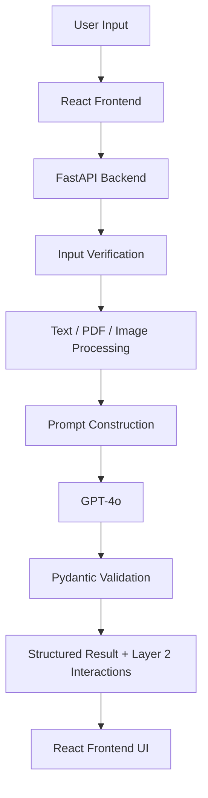
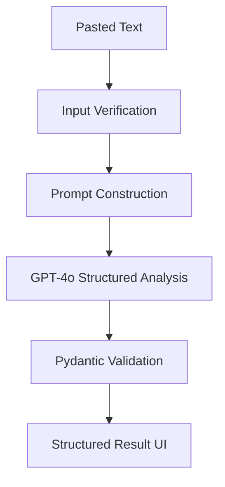
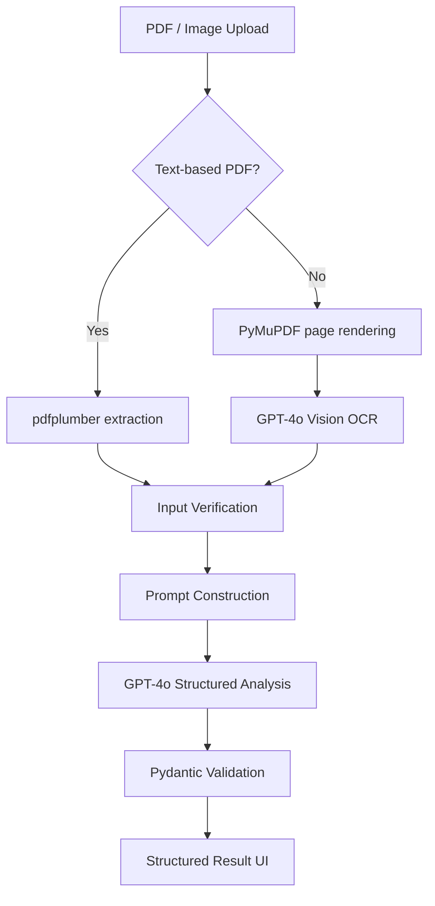
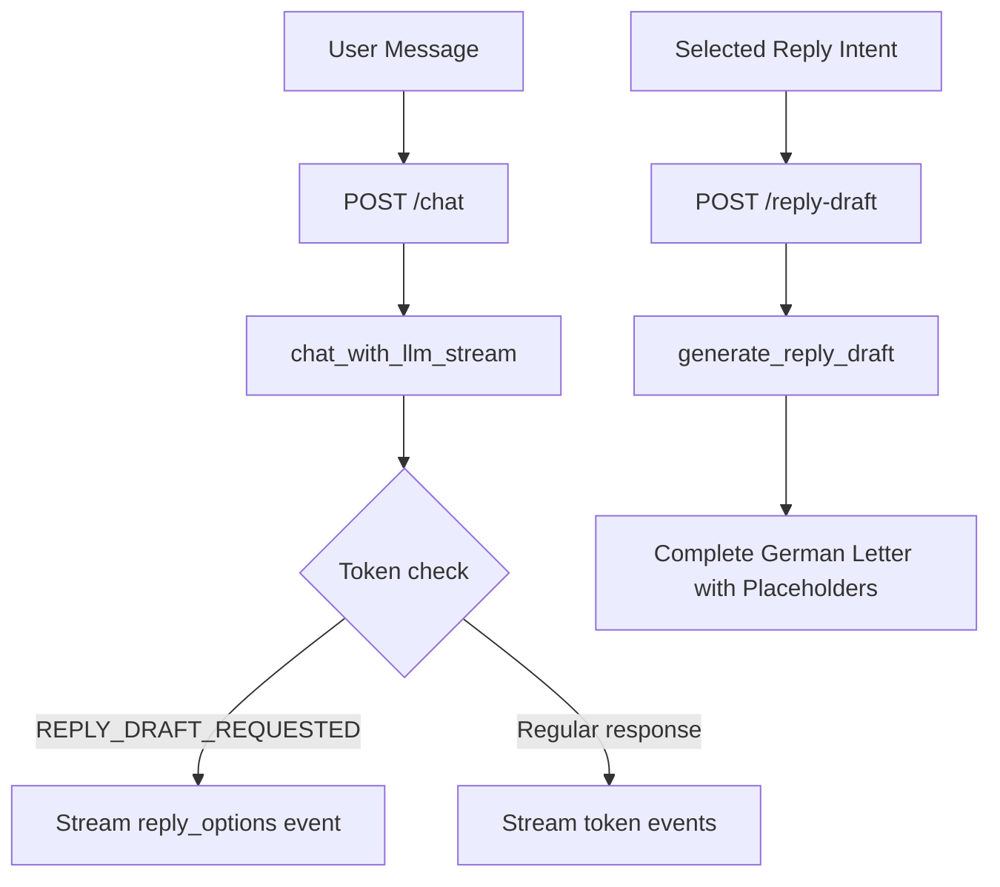

# Architecture

This document explains how Letter Assistant works end to end: what calls what, where GPT-4o is used, how prompting and grounding work, and where validation and privacy controls happen.

---

## Two-Layer Architecture

Letter Assistant is built around a deliberate two-layer design.

**Layer 1 — Document Understanding**
The system converts the uploaded letter into a validated structured representation: deadlines, required actions, documents, payment details, risks, urgency, and analysis quality. This happens once per letter.

**Layer 2 — User Interaction**
Guided follow-up, open chat, and reply draft generation all operate on this validated representation — not by reinterpreting the original letter from scratch. This keeps responses consistent, grounded, and cheaper to generate.

This separation is the core architectural decision. Everything else follows from it.

---

## System Overview

---

## Main Components

| Component | Responsibility |
|---|---|
| React frontend | Upload letters, display structured results, guided follow-up, open chat, reply draft |
| FastAPI backend | Route requests, coordinate processing, call GPT-4o, validate outputs |
| Input verification | Reject non-letter content before full analysis |
| pdfplumber | Extract text from text-based PDFs |
| PyMuPDF + GPT-4o Vision | Process scanned PDFs and image uploads |
| GPT-4o | Letter analysis, OCR, grounded chat, guided follow-up, reply draft, translation |
| Pydantic | Validate all structured LLM outputs before they reach the frontend |
| Translation service | Re-translate existing analysis into any of 16 supported languages without re-analyzing |

---

## Input Processing

Letter Assistant supports three input types: pasted text, text-based PDFs, and scanned or image-based letters.

### Text Input

### PDF and Image Input

If pdfplumber extracts fewer than 50 characters, the system automatically falls back to GPT-4o Vision OCR — no manual switch needed.

---

## LLM Integration

GPT-4o handles all intelligent tasks:

| Task | GPT-4o Role |
|---|---|
| Input verification | Classify whether the input is an official German letter |
| Letter analysis | Extract structured facts from the letter text |
| OCR | Read text from scanned PDFs and image uploads |
| Guided follow-up | Answer one of four predefined question types using selected letter fields |
| Open chat | Answer user questions grounded in the current letter and its analysis |
| Reply draft | Generate a formal German reply based on user intent and extracted letter facts |
| Translation | Re-translate an existing structured analysis into a different output language |

Structured model output is first validated with the internal
`LLMAnalysisResponse` schema. That schema contains only fields generated by the
model, including the invalid-letter `message`. Backend-generated fields such as
`letter_text`, `confidence_level`, and `confidence_reason` are added only after
that validation.

The analysis service then returns one of two public API models:
`AnalyzeTextResponse` for a valid letter or `InvalidLetterResponse` for rejected
input. This keeps the frontend contract small and predictable while preserving
strict validation inside the backend.

---

## Grounding Strategy

Letter Assistant does not use RAG, a vector database, or an external knowledge base.

Grounding comes entirely from:

1. The uploaded or pasted letter text
2. The validated structured analysis produced in Layer 1
3. Selected fields passed into follow-up, chat, and reply-draft prompts

The chat system prompt always includes the full letter text and the validated analysis object. The model is instructed not to answer from general knowledge.

---

## Chat and Reply Draft Flow

Open chat uses SSE token events. When the model detects a draft request, the
backend emits a `reply_options` event without exposing the model's control
token. The selected intent is then sent to `/reply-draft`, which returns one
complete formal German draft as JSON.

---

## Confidence Level Calculation

Analysis quality is **not generated by the LLM**. It is calculated in `analysis_service.py` using explicit rules applied to the validated structured output:

| Level | Conditions |
|---|---|
| `low` | Letter text under 200 characters, or `required_actions` empty, or both `sender` and `letter_topic` unknown |
| `medium` | `sender` or `letter_topic` unknown, or letter involves payment but `payment_information` is empty, or urgency is not Low but `deadlines` is empty |
| `high` | None of the above conditions apply |

This makes confidence explainable and consistent — not a probabilistic guess from the model.

Each condition also produces a specific internal reason key, such as
`deadline_missing` or `payment_incomplete`. When an existing analysis is
translated, the backend identifies that exact reason and localizes it in the
target language. It never guesses the reason from `high`, `medium`, or `low`.

---

## API Endpoints

| Endpoint | Method | Purpose |
|---|---|---|
| `/analyze-text` | POST | Analyze pasted letter text |
| `/analyze-pdf` | POST | Analyze uploaded PDF or image file |
| `/follow-up` | POST | Answer one of four guided follow-up questions |
| `/chat` | POST | Stream grounded open-chat responses and reply-option events |
| `/reply-draft` | POST | Generate one complete formal German reply |
| `/translate` | POST | Re-translate an existing analysis into a different language |
| `/health` | GET | Check backend availability |

Full request and response schemas are in [API.md](API.md).

---

## Validation and Error Handling

| Boundary | Control |
|---|---|
| Before analysis | Input verification classifies non-letter content with `is_valid_letter: false` |
| After LLM analysis | Pydantic validates the internal model-output schema, including the invalid-letter message |
| Before the API response | The analysis service returns either `AnalyzeTextResponse` or `InvalidLetterResponse` |
| After follow-up | Pydantic validates the follow-up response format |
| During chat | Streaming failures are returned as a controlled SSE `error` event |

---

## Privacy Design

- Letter text is processed in memory only
- No letter content is written to a database or log
- No permanent storage of any kind
- Synthetic and anonymized letters are used for demos and evaluation
