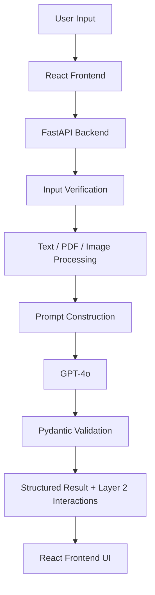
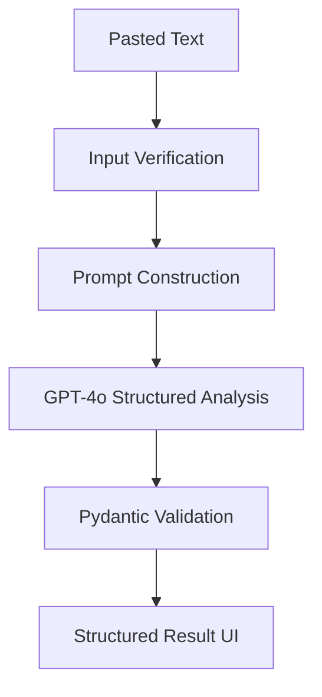
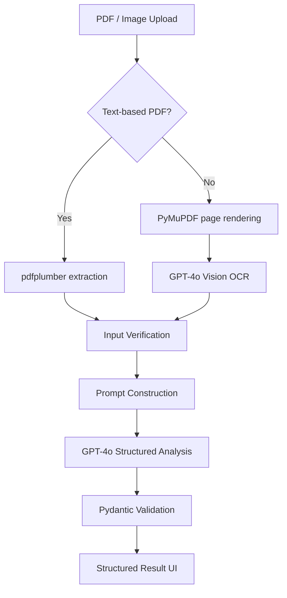
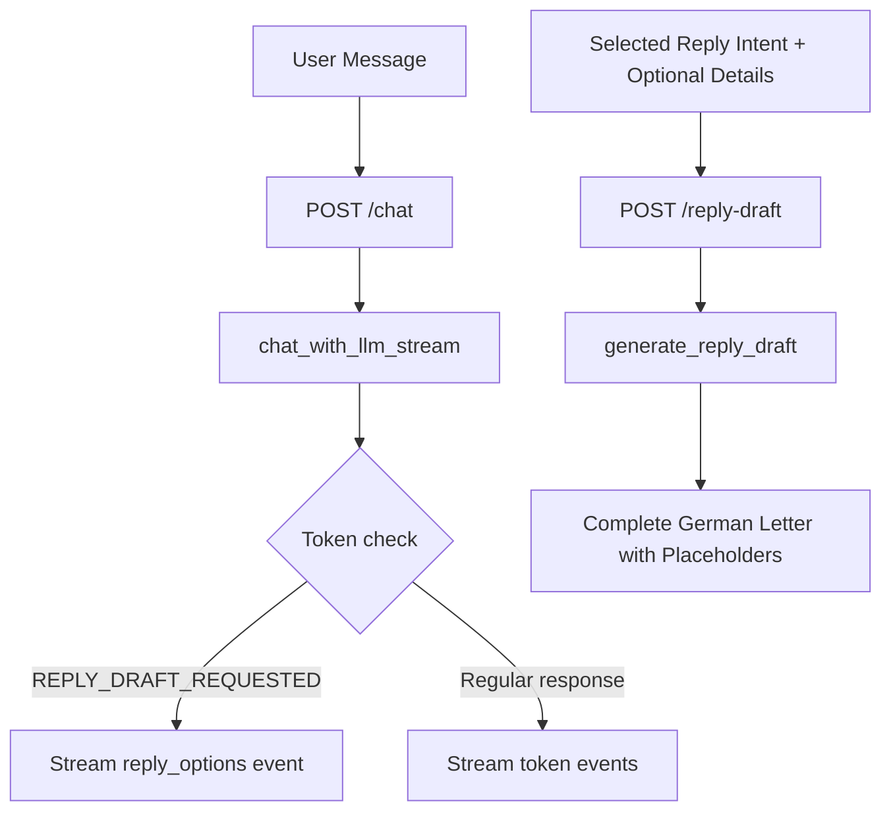

# Architecture

This document explains how Letter Assistant works end to end: what calls what, where GPT-4o is used, how prompting and grounding work, and where validation and privacy controls happen.

---

## Two-Layer Architecture

Letter Assistant is built around a deliberate two-layer design.

**Layer 1 — Document Understanding**
The system converts the uploaded letter into a validated structured representation: deadlines, required actions, documents, payment details, risks, urgency, and analysis quality. This happens once per letter.

**Layer 2 — User Interaction**
Guided follow-up and reply drafting operate on the validated representation.
Open chat receives both that representation and the original letter text so it
can answer grounded questions about facts that do not fit the flat schema. The
current frontend routes its four quick prompts through open chat; the bounded
`/follow-up` endpoint remains available to API clients.

This separation is the core architectural decision. Everything else follows from it.

---

## System Overview

---

## Main Components

| Component | Responsibility |
|---|---|
| React frontend | Upload letters, display structured results, provide quick chat prompts, open chat, reply drafting, translation, and temporary three-letter history |
| FastAPI backend | Route requests, coordinate processing, call GPT-4o, validate outputs |
| Input verification | Classify non-letter content within the structured analysis call and return a compact rejection response |
| pdfplumber | Extract text from text-based PDFs |
| PyMuPDF + GPT-4o Vision | Process scanned PDFs and image uploads |
| GPT-4o | Letter analysis, OCR, grounded chat, guided follow-up, reply draft, translation |
| Pydantic | Validate all structured LLM outputs before they reach the frontend |
| Translation service | Re-translate existing analysis into any of 16 supported languages without re-analyzing |

---

## Input Processing

Letter Assistant supports three input types: pasted text, text-based PDFs, and scanned or image-based letters.

### Text Input

### PDF and Image Input

If pdfplumber extracts fewer than 50 characters, the system automatically falls back to GPT-4o Vision OCR — no manual switch needed.

Before document processing, the API verifies the declared file type against
the file signature. Runtime limits default to 10 MB per upload, 20 PDF pages,
and 100,000 extracted text characters. These values are configurable through
environment variables.

---

## LLM Integration

GPT-4o handles all intelligent tasks:

| Task | GPT-4o Role |
|---|---|
| Input verification | Classify whether the input is an official German letter |
| Letter analysis | Extract structured facts from the letter text |
| OCR | Read text from scanned PDFs and image uploads |
| Guided follow-up | Answer one of four predefined question types using selected letter fields |
| Open chat | Answer user questions grounded in the current letter and its analysis |
| Reply draft | Generate an editable formal German reply from a safe intent, optional bounded context, and extracted letter facts |
| Translation | Re-translate an existing structured analysis into a different output language |

Structured model output is first validated with the internal
`LLMAnalysisResponse` schema. That schema contains only fields generated by the
model, including the invalid-letter `message`. Backend-generated fields such as
`letter_text`, `confidence_level`, and `confidence_reason` are added only after
that validation.

The analysis service then returns one of two public API models:
`AnalyzeTextResponse` for a valid letter or `InvalidLetterResponse` for rejected
input. This keeps the frontend contract small and predictable while preserving
strict validation inside the backend.

All OpenAI calls use one configured client with a 60-second timeout and one
retry by default. Analysis, follow-up, chat, and reply generation each have an
explicit output-token budget. If the provider or API key is not configured,
the API returns HTTP `503`; no sample analysis, chat answer, or reply draft is
substituted.

Before the public response is created, the backend also normalizes exact dates
from the source letter and rejects any calendar date in the generated analysis
that is absent from that source (apart from the injected current date used for
urgency). This deterministic check prevents fluent output from silently
changing a day, month, or year.

---

## Grounding Strategy

Letter Assistant does not use RAG, a vector database, or an external knowledge base.

Grounding comes entirely from:

1. The uploaded or pasted letter text
2. The validated structured analysis produced in Layer 1
3. Endpoint-specific bounded context: selected fields for `/follow-up`, full
   letter plus analysis and conversation history for `/chat`, or analysis plus
   fixed intent and optional details for `/reply-draft`

The chat system prompt always includes the full letter text and the validated analysis object. The model is instructed not to answer from general knowledge.
All prompts also treat letter and analysis content as untrusted source data and
instruct the model not to follow embedded attempts to change its role, rules,
or output format.

---

## Chat and Reply Draft Flow

Open chat uses SSE token events. When the model detects a draft request, the
backend emits a `reply_options` event without exposing the model's control
token. The selected intent and optional bounded user details are then sent to
`/reply-draft`, which returns one complete formal German draft as JSON. The
frontend displays the result in an editable text area.

---

## Confidence Level Calculation

Analysis quality is **not generated by the LLM**. It is calculated in `analysis_service.py` using explicit rules applied to the validated structured output:

| Level | Conditions |
|---|---|
| `low` | Letter text under 200 characters; or urgency is not Low while `required_actions` is empty; or both `sender` and `letter_topic` are unknown |
| `medium` | `sender` or `letter_topic` is unknown; or a payment letter lacks a recognizable IBAN or recipient; or urgency is not Low while `deadlines` is empty |
| `high` | None of the above conditions apply |

This makes confidence explainable and consistent — not a probabilistic guess from the model.

Each condition also produces a specific internal reason key, such as
`deadline_missing` or `payment_incomplete`. When an existing analysis is
translated, the backend identifies that exact reason and localizes it in the
target language. It never guesses the reason from `high`, `medium`, or `low`.

---

## API Endpoints

| Endpoint | Method | Purpose |
|---|---|---|
| `/analyze-text` | POST | Analyze pasted letter text |
| `/analyze-pdf` | POST | Analyze uploaded PDF or image file |
| `/follow-up` | POST | Answer one of four guided follow-up questions |
| `/chat` | POST | Stream grounded open-chat responses and reply-option events |
| `/reply-draft` | POST | Generate one formal German reply from intent and optional bounded context |
| `/translate` | POST | Re-translate an existing analysis into a different language |
| `/health` | GET | Check backend availability |
| `/ready` | GET | Check whether the LLM provider is configured |

Full request and response schemas are in [API.md](API.md).

---

## Validation and Error Handling

| Boundary | Control |
|---|---|
| Before analysis | Input verification classifies non-letter content with `is_valid_letter: false` |
| Before document processing | File size, signature, type, page count, and extracted text length are bounded |
| After LLM analysis | Pydantic validates the internal model-output schema, including the invalid-letter message |
| After schema validation | Deterministic date grounding rejects exact dates absent from the source letter |
| Before the API response | The analysis service returns either `AnalyzeTextResponse` or `InvalidLetterResponse` |
| After follow-up | Pydantic validates the follow-up response format |
| Before LLM calls | Provider configuration is required; missing configuration returns HTTP `503` |
| During chat | Streaming failures are returned as a controlled SSE `error` event |

Allowed browser origins are loaded from `CORS_ORIGINS`. Defaults include the
local Vite frontend and the deployed Vercel frontend; additional deployment
origins must be listed explicitly.

---

## Privacy Design

- Letter text is processed in memory only
- No letter content is written to a database or log
- No permanent storage of letter content; only the frontend theme preference is persisted
- The frontend may retain up to three analyzed letters in the current tab's in-memory state for temporary navigation. This state is never sent to a database or persistent browser storage and is lost on refresh or tab close.
- Letter content is transmitted to OpenAI for analysis and, when needed, OCR or follow-up generation; users should not treat the tool as appropriate for unrestricted handling of highly sensitive documents.
- Synthetic and anonymized letters are used for demos and evaluation
